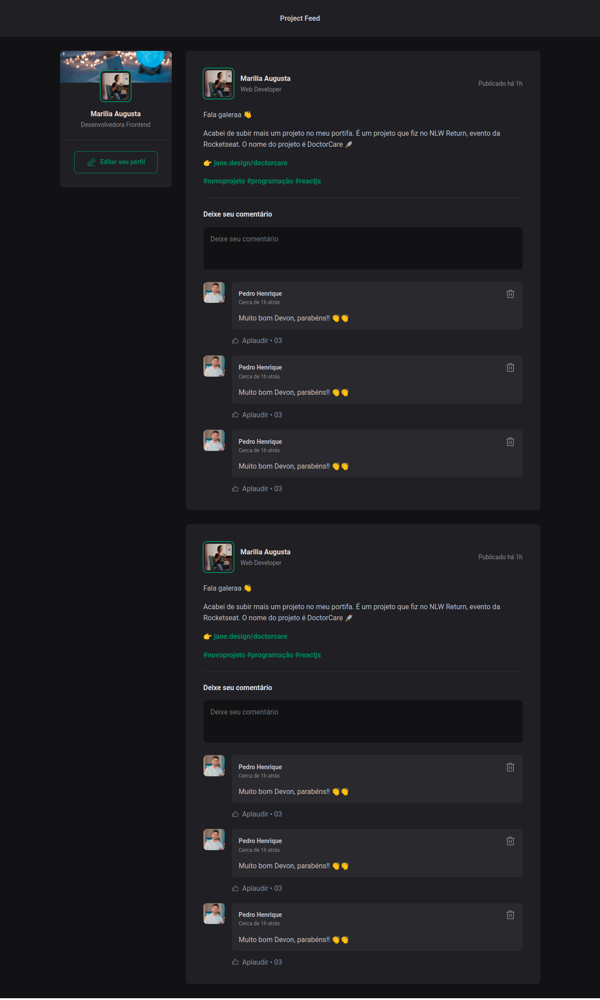

# React + Vite
<h4 align="center"> 
	🚧  Project Feed 🚀 Under construction...  🚧
</h4>

<h1 align="center">
  
</h1>

### Features

- [x] Component Sidebar
- [x] Component Post
- [x] Component Comment
- [x] Component Avatar

## Component Sidebar

This component is responsible for creating the sidebar (or side menu) in a user interface. Typically, a sidebar contains links to different sections or features of the app.


## Component Post

This component represents a post of content in an application. It may contain information such as the post author, post content, publication date, and other details related to a post.

## Component Comment

The Comment Component is designed to display comments made on a post or content. It may contain information about the author of the comment, the text of the comment, and the date/time it was made.

## Component Avatar

This component typically displays an image or avatar associated with a user, whether in the sidebar, in a post, or in a comment. It can be used to visually identify the author of an action or content.

## Function

- [x] Add comments 
- [x] Applause (likes) 
- [x] Delete comment

### 🛠 Tecnologias

- [React](https://pt-br.reactjs.org/)
- [Vite](https://vitejs.dev/)
- [Vite](https://reactrouter.com/en/main)
<!-- - Date-fns -->
- [Phosphor-react](https://phosphoricons.com/)

### ✨ Pré-requisitos

Before you begin, you will need to have the following tools installed on your machine:
- [Git](https://git-scm.com)
- [Node.js](https://nodejs.org/en)
Additionally, it's good to have a code editor to work with the code, such as [VSCode](https://code.visualstudio.com/).


### Rodando Project

```bash
# Clone this repository
$ git clone https://github.com/devMarilia/feed-project

# Navigate to the project folder in your terminal/cmd
$ cd feed-project

# Install the dependencies
$ yarn or npm install

# Run the application in development mode
$ yarn dev or npm run dev

# The server will start on port 3333 - access it at http://localhost:4000/

```
